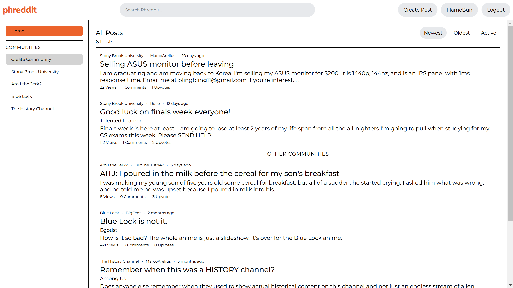
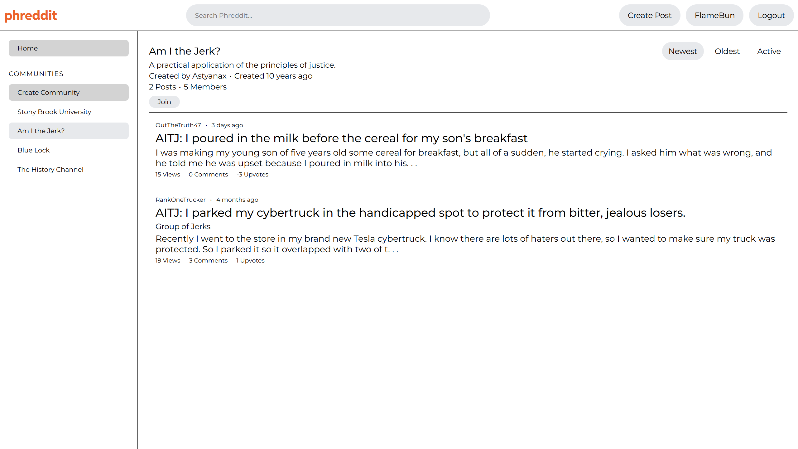
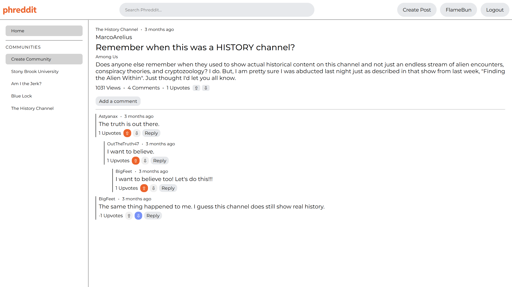
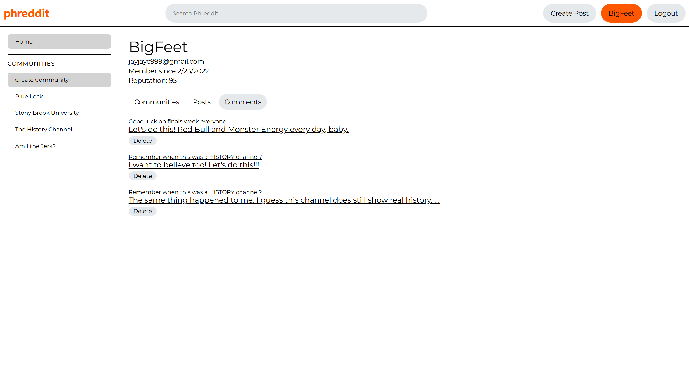
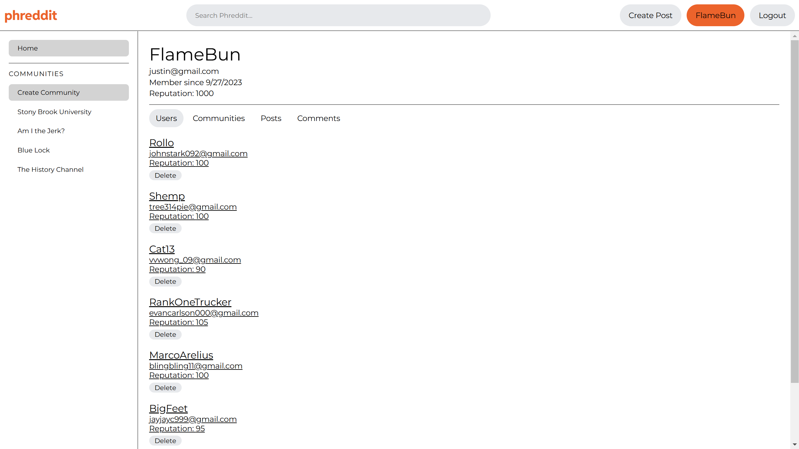

# Phreddit
The web application Phreddit is a full-stack Reddit clone incorporating several of Reddit's main features. Users can create/join communities, post content, reply to posts and comment threads, and upvote/downvote. Through their user profiles, they can also edit or delete the communities, posts, and comments they have created.

  
  
<em>Home Page</em>

 

  
  
<em>Community Page</em>

 

  
  
<em>Post Page</em>

 

  
  
<em>User Profile</em>

 

  
  
<em>Admin Profile</em>

## How to Get Started
1. Install Node.js and MongoDB if not done already.
2. In the `server` and `client` directories, run `npm install`.
3. Run the MongoDB service on 127.0.0.1:27017.
4. In the server directory, run `node server.js`.
5. In the client directory, run `npm start`.

## Initialize the Database
To initialize the underlying database of the Phreddit web application with the  provided sample data in initializeDB.js, in the `server` directory, run the following command:
<pre>
node initializeDB.js [email] [display name] [password]
</pre>
As part of the data initialization, the email, display name, and password specified in the command will be the credentials for the newly created admin account. 

The sample data contains one admin account and seven non-admin user accounts, each listed on a separate row in the format `[full name] | [display name] | email`:
<pre>
(ADMIN) Jennifer Aniston | OutTheTruth47 | jenaniston124@gmail.com

Johnny Stark | Rollo | johnstark092@gmail.com
Hannah Thompson | Shemp | tree314pie@gmail.com
Vivian Wong | Cat13 | vvwong_09@gmail.com
Evan Carlson | RankOneTrucker | evancarlson000@gmail.com
Mark Star | MarcoArelius | blingbling11@gmail.com
Jay Chang | BigFeet | jayjayc999@gmail.com
Asta Moon | Astyanax | astamoon555@gmail.com
</pre>
The password for all of the listed accounts is `cse316`.

Admins and non-admins can freely edit or delete their communities, posts, and comments. However, admins have special permissions to edit or delete other non-admins' communities, posts, and comments. Admins can even delete other non-admin accounts as well.

## Contributors

<ul>
<li><a href="https://github.com/FlameBun">Justin Wu</a></li>
<li><a href="https://github.com/AmandaW0143">Amanda Wang</a></li>
</ul>
